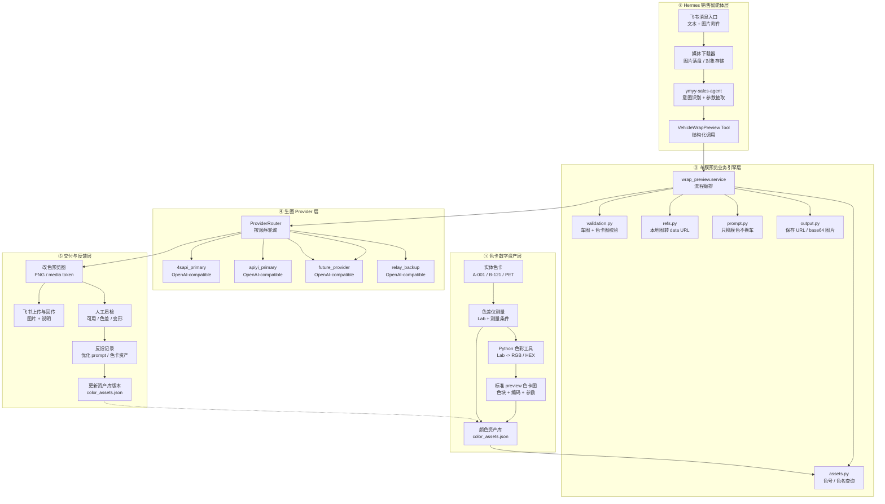
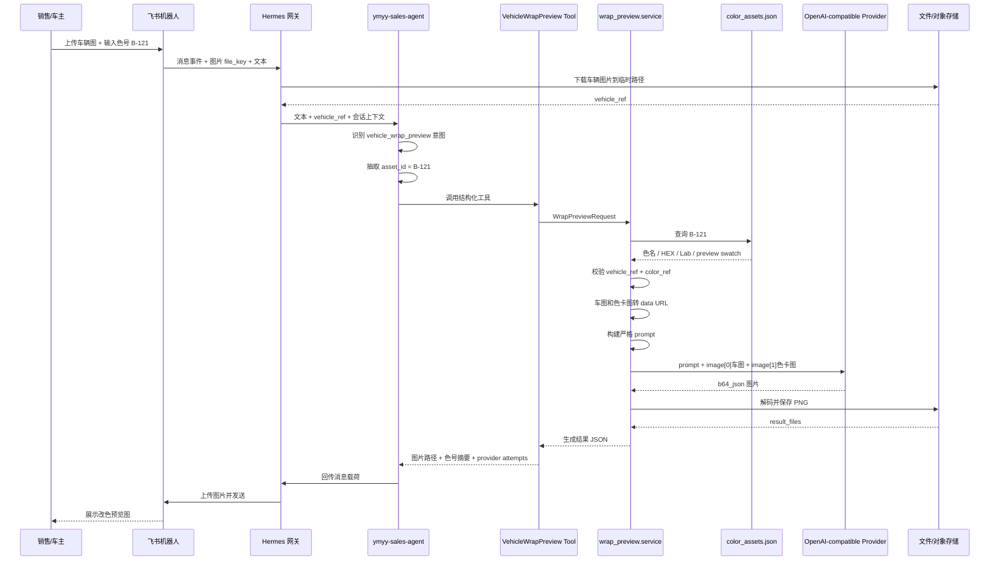
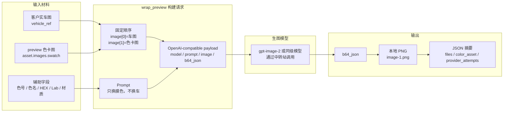
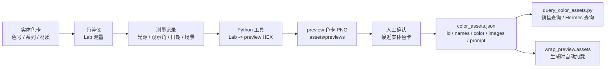
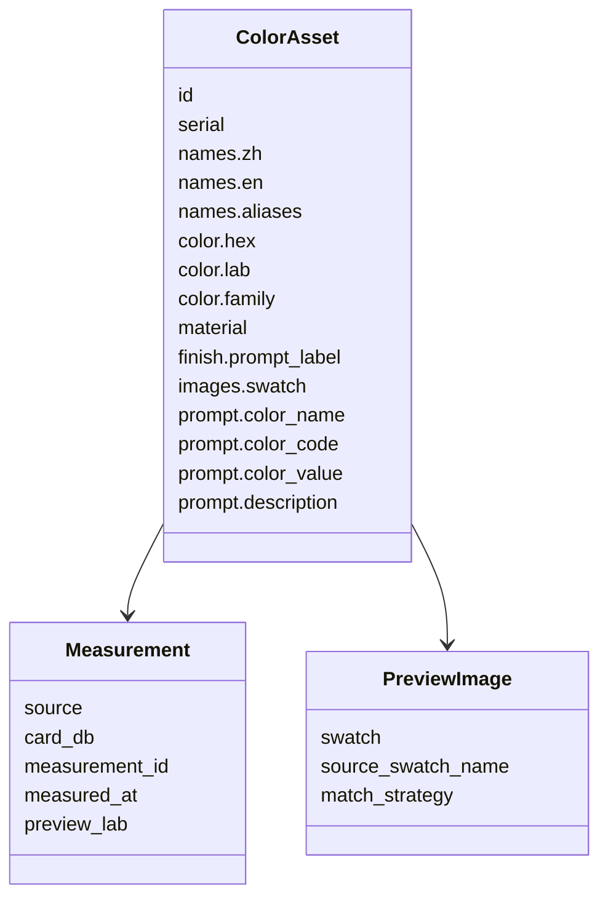
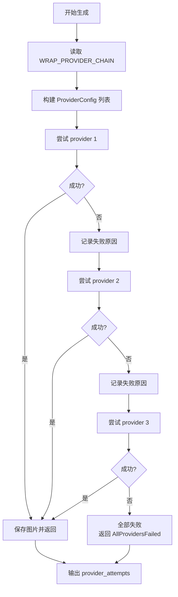
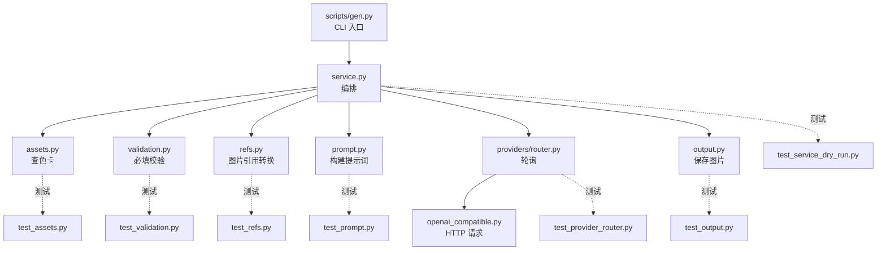
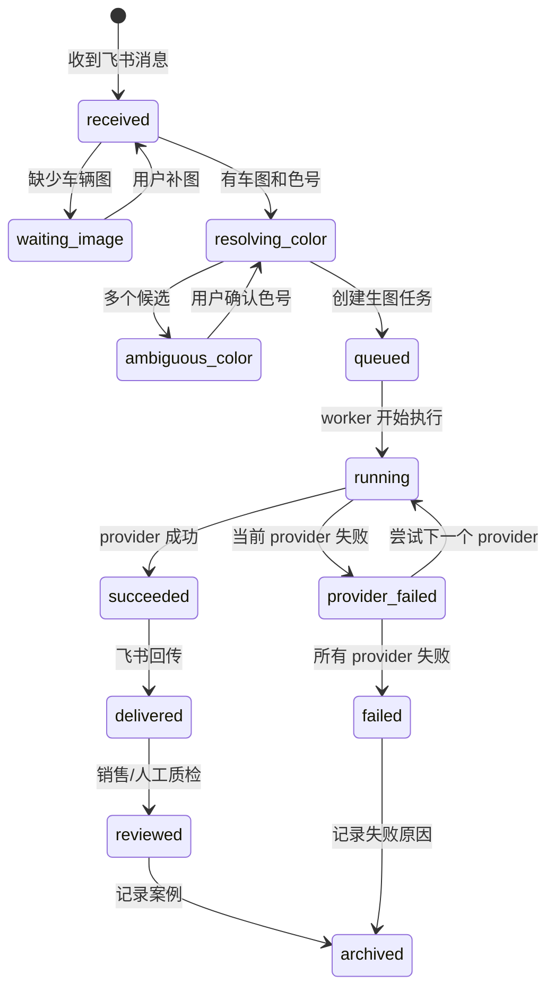
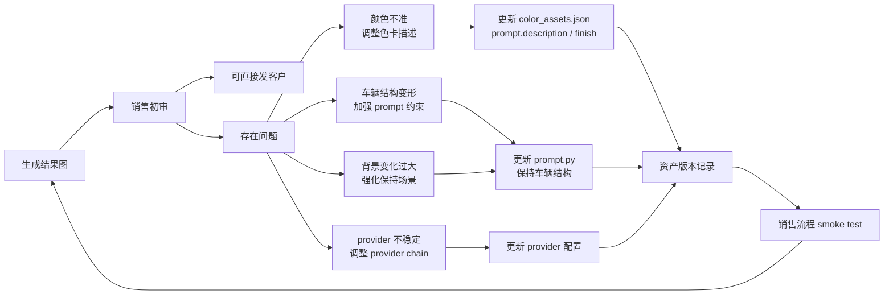

# 车膜色卡数字化与 AI 改色预览详细架构

## 设计目标

这份架构图是在原有“车膜色卡数字化与 AI 改色渲染架构”基础上进一步展开，用来指导后续迁移到 Hermes `ymyy-sales-agent`。

核心目标：

- 色卡数据从实体测量到数字资产可追溯。
- 销售侧只需要上传车图和输入色号。
- Hermes 负责意图识别、文件处理、任务调度和回传。
- `wrap_preview` 保持为可测试的生图业务引擎。
- provider 作为可替换外部通道，支持多个 OpenAI-compatible API 轮询。
- 每次生成进入质检和反馈闭环，持续优化颜色资产和 prompt。

## 总体分层架构



## 销售运行时详细链路



## 生图请求内部结构



## Prompt 业务合同

生图 prompt 是业务合同，迁移和模块化时不能随意改变。当前核心约束如下：

```text
客户车辆照片是唯一车辆主体参考。
preview 色卡图是目标车膜颜色和膜面视觉效果的主要颜色参考。
不要只根据文字、HEX 或 Lab 猜测颜色，也不要用 Lab 重新换算目标颜色。
只修改需要贴膜覆盖的区域颜色与材质表现。
不要改变车型、轮毂、车灯、车窗、车牌、背景、角度、透视、光影。
不要生成概念图、插画、海报或重新设计效果。
最终效果必须像同一辆车在同一地点贴完膜后重新拍摄的照片。
```

对模型提交时，`HEX`、`Lab` 和色名只作为辅助字段，真正颜色依据必须是 `preview 色卡图`。

## 色卡资产生产链路



### 颜色资产字段



## Provider Failover 详细逻辑



Provider 配置例子：

```bash
WRAP_PROVIDER_CHAIN=4sapi_primary,apiyi_primary,xinghu_third,relay_backup

WRAP_PROVIDER_4SAPI_PRIMARY_BASE_URL=https://4sapi.com/v1
WRAP_PROVIDER_4SAPI_PRIMARY_API_KEY=...
WRAP_PROVIDER_4SAPI_PRIMARY_MODEL=gpt-image-2
WRAP_PROVIDER_4SAPI_PRIMARY_AUTH_SCHEME=bearer

WRAP_PROVIDER_RELAY_BACKUP_BASE_URL=https://backup.example.com/v1
WRAP_PROVIDER_RELAY_BACKUP_API_KEY=...
WRAP_PROVIDER_RELAY_BACKUP_MODEL=gpt-image-2

WRAP_PROVIDER_XINGHU_THIRD_BASE_URL=https://xinghuapi.com/v1
WRAP_PROVIDER_XINGHU_THIRD_API_KEY=...
WRAP_PROVIDER_XINGHU_THIRD_MODEL=gpt-image-2
WRAP_PROVIDER_XINGHU_THIRD_REQUEST_STYLE=refs_array
WRAP_PROVIDER_XINGHU_THIRD_WATERMARK=true
WRAP_PROVIDER_XINGHU_THIRD_RESPONSE_FORMAT=url
WRAP_PROVIDER_RELAY_BACKUP_AUTH_SCHEME=bearer
```

默认使用：

```text
response_format = b64_json
```

原因：某些中转站返回 URL 后可能在下载阶段出现 HTTP 403，`b64_json` 更适合自动化销售回传链路。

## 模块职责与可测试点



## 任务状态机



## 质量反馈闭环



## 错误兜底路径

| 错误类型 | 判断条件 | 用户话术 | 系统处理 |
| --- | --- | --- | --- |
| 缺少车图 | 没有 `vehicle_ref` | 需要先上传客户车辆图片 | 等待用户补图 |
| 缺少色卡 | 没有 `asset_id` 且没有 `color_ref` | 请提供色号或 preview 色卡图 | 返回参数缺失 |
| 色号不存在 | 资产库查不到 | 没有找到该色号，请确认 | 提供候选或让用户重输 |
| 色号模糊 | 命中多个相似资产 | 找到多个相似色号，请选择 | 返回候选列表 |
| provider 失败 | 当前 API 报错 | 正在切换备用通道 | router 尝试下一个 |
| provider 全挂 | 全部 provider 失败 | 当前生图通道不可用，请稍后重试 | 记录失败原因 |
| URL 下载 403 | URL 返回但无法下载 | 自动改用 base64 模式 | 默认使用 `b64_json` |

## Hermes 迁移后的落地点

```text
hermes-cloud-deployment/
  skills/
    ark-seedream-car-preview/
      wrap_preview/
      references/
      assets/
      scripts/

  knowledge-base/
    ymyy-sales-agent/
      vehicle-wrap-preview.md

  agents/
    ymyy-sales-agent/
      tools/
        vehicle_wrap_preview.py
      workflows/
        vehicle_wrap_preview_flow.py
```

建议保持 `wrap_preview` 作为独立业务引擎，Hermes 只通过工具包装层调用，不直接改内部 prompt、provider、色卡查询逻辑。

## 验收用例

| 用例 | 输入 | 期望 |
| --- | --- | --- |
| 宝马 M4 + A-001 | 车图 + `A-001` | 输出阿布扎比蓝预览图 |
| 宝马 M4 + B-120 | 车图 + `B-120` | 输出玉米黄预览图 |
| 小鹏 P7 + B-121 | 车图 + `B-121` | 输出沙丘黄预览图 |
| 缺少车图 | 仅 `B-121` | 返回补图提示 |
| 错误色号 | 车图 + `ZZ-999` | 返回色号不存在 |
| provider 失败 | primary API 故障 | 自动尝试 backup |

## 当前最重要的实现边界

不要把以下内容混进 `ymyy-sales-agent` 主逻辑：

- provider HTTP 细节
- base64 解码细节
- prompt 长文本
- 色卡 JSON fuzzy 查询细节
- 本地路径转 data URL 细节

这些都应该留在 `wrap_preview` 里。`ymyy-sales-agent` 只负责识别销售意图、准备结构化参数、调用工具、组织回传话术。
