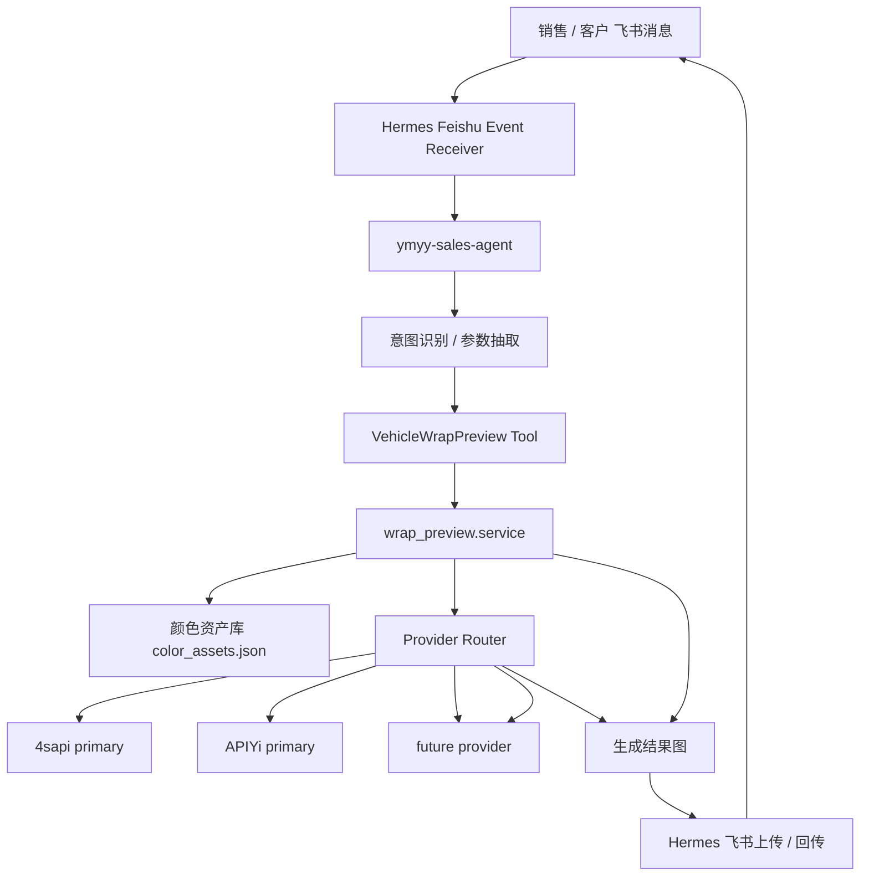
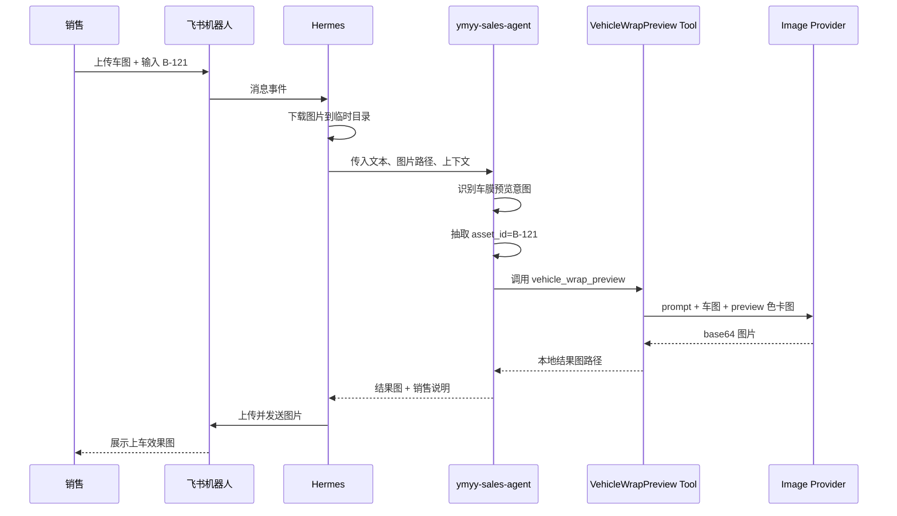

# 车膜预览 Skill 迁移到 Hermes ymyy-sales-agent 计划

## 目标

将当前已经模块化的 `ark-seedream-car-preview` skill，迁移为 Hermes 中 `ymyy-sales-agent` 可以稳定调用的正式销售能力。

迁移后的目标不是让销售手动运行脚本，而是让销售在飞书里自然发送：

```text
帮客户把这台车换成 B-121 看看
用 A-001 阿布扎比蓝生成上车效果
这张车图贴沙丘黄预览一下
```

Hermes 能自动完成：

```text
识别意图 -> 提取车图和色号 -> 查询色卡资产 -> 调用生图服务 -> 回传结果图 -> 记录案例
```

## 当前状态

当前 skill 已经完成第一阶段模块化：

```text
ark-seedream-car-preview/
  scripts/
    gen.py
    gen_and_send.py
    query_color_assets.py
    build_color_assets.py

  wrap_preview/
    assets.py
    prompt.py
    refs.py
    validation.py
    output.py
    service.py
    providers/
      openai_compatible.py
      router.py

  references/
    color_assets.json

  assets/
    previews/
```

已验证能力：

- `color_assets.json` 可通过色号查询，例如 `A-001`、`B-120`、`B-121`。
- 命中色号后自动追加 preview 色卡图。
- 生成 prompt 时明确要求“只换膜色，不换车”。
- 本地车图和本地色卡图可转为 data URL。
- provider 支持 OpenAI-compatible API。
- provider router 支持 failover。
- 默认使用 `b64_json`，避免中转站临时 URL 下载 403。
- 已用真实销售流程测试宝马 M4、小鹏 P7 图片。

## 总体架构

迁移后的角色关系：



核心原则：

```text
wrap_preview 是生图发动机。
ymyy-sales-agent 是销售驾驶舱。
Hermes 负责飞书消息、文件下载、任务调度、结果回传。
```

## ymyy-sales-agent 新增能力

建议新增业务能力名称：

```text
vehicle_wrap_preview
```

或对销售更友好的别名：

```text
preview-color-wrap
car-wrap-preview
贴膜上车效果图
改色膜预览
```

### 触发语义

满足以下任一情况时触发：

- 销售上传车图，并输入色号，例如 `B-121`。
- 用户说“帮我看看这个颜色上车效果”。
- 用户说“生成贴膜效果图”“改色预览”“上车图”。
- 消息中包含车膜色号、色名、色系，并且上下文有车辆图片。

示例：

```text
这台小鹏 P7 换 B-121 试试
客户想看 A-001 阿布扎比蓝
用沙丘黄生成一下上车效果
帮我把这台 M4 换成玉米黄
```

### 不触发场景

以下情况不触发：

- 只询问价格、库存、施工时间。
- 没有车辆图，且用户明确要生成客户实车预览。
- 用户要求换车型、换轮毂、加套件、生成概念海报。
- 只是查询色号信息，不需要生成图片。

## 标准输入

Hermes 工具层建议使用结构化输入：

```json
{
  "task": "vehicle_wrap_preview",
  "vehicle_ref": "/tmp/hermes/uploads/customer-car.jpg",
  "asset_id": "B-121",
  "delivery": {
    "enabled": true,
    "channel": "feishu",
    "target": "chat_id_or_open_id"
  },
  "generation": {
    "size": "auto",
    "quality": "high",
    "response_format": "b64_json"
  },
  "context": {
    "requester": "sales_user_id",
    "conversation_id": "feishu_message_or_thread_id",
    "source": "ymyy-sales-agent"
  }
}
```

如果没有命中色号，但销售提供了手动色卡图，可使用：

```json
{
  "task": "vehicle_wrap_preview",
  "vehicle_ref": "/tmp/hermes/uploads/customer-car.jpg",
  "color_ref": "/tmp/hermes/uploads/manual-color-card.png",
  "color_name": "勃艮第酒红",
  "color_code": "manual-LPR803",
  "color_value": "#8B2942",
  "finish": "哑光",
  "description": "低饱和高级感，偏暖红酒色"
}
```

## 标准输出

成功输出：

```json
{
  "status": "succeeded",
  "provider": "4sapi_primary",
  "color": {
    "id": "B-121",
    "name": "沙丘黄",
    "hex": "#EBC6A0",
    "swatch_path": "/path/to/B-121-measurement-24.png"
  },
  "files": [
    "/tmp/xpeng-p7-wrap-preview-b121/image-1.png"
  ],
  "message": "这是基于客户实车图和 B-121 preview 色卡图生成的 AI 贴膜预览，实际颜色以实体色卡和施工效果为准。"
}
```

失败输出：

```json
{
  "status": "failed",
  "error_type": "missing_vehicle_image",
  "message": "需要先上传客户车辆图片，我才能生成上车效果图。"
}
```

## Hermes 工具包装层

建议在 `ymyy-sales-agent` 中新增工具包装，而不是让 agent 直接操作 `scripts/gen.py`。

候选路径：

```text
agents/ymyy-sales-agent/tools/vehicle_wrap_preview.py
```

工具伪代码：

```python
from pathlib import Path

from skills.ark_seedream_car_preview.wrap_preview.models import WrapPreviewRequest
from skills.ark_seedream_car_preview.wrap_preview.service import generate_wrap_preview


def run_vehicle_wrap_preview(payload: dict) -> dict:
    request = WrapPreviewRequest(
        vehicle_refs=[payload["vehicle_ref"]],
        asset_id=payload.get("asset_id", ""),
        color_refs=[payload["color_ref"]] if payload.get("color_ref") else [],
        color_name=payload.get("color_name", ""),
        color_code=payload.get("color_code", ""),
        color_value=payload.get("color_value", ""),
        finish=payload.get("finish", ""),
        description=payload.get("description", ""),
        size=payload.get("generation", {}).get("size", "auto"),
        quality=payload.get("generation", {}).get("quality", "high"),
        response_format=payload.get("generation", {}).get("response_format", "b64_json"),
        out_dir=Path(payload.get("out_dir", "/tmp/hermes/wrap-preview")),
    )
    return generate_wrap_preview(request)
```

注意：这只是接口形态示例，最终路径要按 Hermes 项目真实包结构调整。

## 飞书消息链路

飞书侧需要完成图片下载和结果上传。



## 参数抽取规则

### 色号归一化

销售可能输入：

```text
B121
B-121
b 121
沙丘黄
Sand Dune Yellow
```

Hermes 应归一化后查询 `color_assets.json`。

当前 `wrap_preview.assets.load_color_asset()` 已支持：

- 精确色号
- 中文名
- 英文名
- aliases
- 简单 fuzzy match

### 图片选择

如果一条消息中有多张图片：

1. 优先选择最新上传的车辆图。
2. 如果同时有色卡图，需判断是否用户手动提供了 `color_ref`。
3. 如果有 `asset_id` 命中资产库，优先使用资产库 preview 色卡图，而不是用户随手发的色块。

## 失败兜底话术

### 缺少车辆图

```text
需要先上传客户车辆图片，我才能生成上车效果图。建议上传车身完整、光线清楚、遮挡较少的照片。
```

### 色号不存在

```text
我没有在色卡库中找到这个色号。你可以发标准色号，例如 A-001、B-121，或者发一张 preview 色卡图让我按手动色卡生成。
```

### 色号模糊

```text
我找到了多个相似色号，需要你确认一下要用哪一个：A-001 宝马阿布扎比蓝、A-003 ...
```

### provider 全部失败

```text
当前生图通道暂时不可用，我已经记录失败信息。你可以稍后重试，或切换备用生图通道后再生成。
```

### 图片质量不足

```text
这张车图可能不太适合生成预览，建议换一张车身更完整、角度更清晰、光线不过曝的图片。
```

## 生成结果说明

建议回传图片时附带说明：

```text
这是基于客户实车图和 B-121 preview 色卡图生成的 AI 贴膜预览图，仅用于上车效果沟通。实际颜色请以实体色卡、现场光线和施工完成效果为准。
```

不要在销售话术中承诺：

```text
百分百一致
没有色差
实物一定一样
```

## 存储与日志

建议每次任务记录：

```json
{
  "job_id": "wrap-preview-20260603-xxxx",
  "requester": "sales_user_id",
  "conversation_id": "feishu_thread_id",
  "vehicle_ref": "/tmp/hermes/uploads/customer-car.jpg",
  "asset_id": "B-121",
  "color_name": "沙丘黄",
  "provider": "4sapi_primary",
  "provider_attempts": [
    {"provider": "4sapi_primary", "ok": true}
  ],
  "result_files": [
    "/tmp/hermes/wrap-preview/image-1.png"
  ],
  "status": "succeeded",
  "created_at": "2026-06-03T22:00:00+08:00"
}
```

这些日志后续可用于：

- 追踪 API 成本。
- 分析哪类车图生成效果差。
- 优化 prompt。
- 评估哪个 provider 更稳定。
- 形成销售案例库。

## 配置管理

生产环境建议使用服务器 secret 或环境变量，不使用明文提交。

```bash
WRAP_PROVIDER_CHAIN=4sapi_primary,apiyi_primary,xinghu_third,relay_backup
WRAP_PROVIDER_4SAPI_PRIMARY_BASE_URL=https://4sapi.com/v1
WRAP_PROVIDER_4SAPI_PRIMARY_API_KEY=...
WRAP_PROVIDER_4SAPI_PRIMARY_MODEL=gpt-image-2
WRAP_PROVIDER_APIYI_PRIMARY_BASE_URL=https://api.apiyi.com/v1
WRAP_PROVIDER_APIYI_PRIMARY_API_KEY=...
WRAP_PROVIDER_APIYI_PRIMARY_MODEL=gpt-image-2-all
WRAP_PROVIDER_XINGHU_THIRD_BASE_URL=https://xinghuapi.com/v1
WRAP_PROVIDER_XINGHU_THIRD_API_KEY=...
WRAP_PROVIDER_XINGHU_THIRD_MODEL=gpt-image-2
WRAP_PROVIDER_XINGHU_THIRD_REQUEST_STYLE=refs_array
WRAP_PROVIDER_XINGHU_THIRD_WATERMARK=true
WRAP_PROVIDER_XINGHU_THIRD_RESPONSE_FORMAT=url
WRAP_PROVIDER_4SAPI_PRIMARY_AUTH_SCHEME=bearer
```

本地开发可以使用：

```text
skills/ark-seedream-car-preview/.env.local
```

该文件必须保持 git ignored。

## 迁移步骤

### Phase 1：工具封装

目标：让 Hermes 可以直接调用模块化 service。

任务：

- 确认 `wrap_preview` 包在 Hermes 运行环境中可 import。
- 新增 `vehicle_wrap_preview` 工具包装。
- 输入结构化 payload，输出结构化 result。
- 保持 `scripts/gen.py` 作为本地调试入口。

验收：

```text
给定 vehicle_ref + asset_id，Hermes 工具能返回本地结果图路径。
```

### Phase 2：飞书图片处理

目标：让飞书上传图片进入生成链路。

任务：

- 从飞书事件中识别图片附件。
- 下载图片到 `/tmp/hermes/uploads/` 或对象存储。
- 将下载后的本地路径传给 `vehicle_wrap_preview`。
- 生成结果后上传回飞书。

验收：

```text
销售在飞书上传车图并发送 B-121，机器人能回传生成图。
```

### Phase 3：意图识别与参数抽取

目标：让销售自然语言触发。

任务：

- 新增车膜预览意图识别。
- 抽取色号、色名、上下文图片。
- 支持 `B121` -> `B-121` 归一化。
- 色号模糊时返回候选项。

验收：

```text
“这台小鹏 P7 换 B121 看看”能触发生图。
```

### Phase 4：任务状态与失败兜底

目标：让生图任务不会阻塞飞书消息处理。

任务：

- 创建任务状态：`queued / running / succeeded / failed`。
- 生成开始时先回复“正在生成”。
- provider 失败时记录 attempts。
- 全部失败时返回清晰话术。

验收：

```text
provider 不可用时，销售能收到可理解的失败说明，而不是静默失败。
```

### Phase 5：案例沉淀与质量反馈

目标：让每次生成成为可复用数据。

任务：

- 保存原图、色号、色卡图、生成图、provider、prompt 版本。
- 支持销售标记“可用 / 不满意 / 色差大 / 结构变形”。
- 将反馈用于优化色卡资产和 prompt。

验收：

```text
每次生成都有可追踪记录，可用于后续优化。
```

## 验收标准

### 功能验收

- 能通过飞书触发车膜预览。
- 能识别色号 `A-001`、`B-120`、`B-121`。
- 能自动使用资产库 preview 色卡图。
- 能生成并回传图片。
- 能处理 provider 返回多张图片。

### 稳定性验收

- provider A 失败时能尝试 provider B。
- 中转站返回 URL 下载 403 时，可通过 `b64_json` 避免。
- 缺少图片、缺少色号、色号模糊时都有明确话术。

### 安全验收

- 不提交真实 API key。
- `.env.local` 被 git ignore。
- 日志不记录完整密钥。

### 业务验收

- 生成图能保持车辆主体、轮毂、车窗、场景大体一致。
- 只改变贴膜覆盖区域颜色。
- 色彩以 preview 色卡图为主。
- 销售话术包含 AI 预览免责声明。

## 后续优先事项

1. 轮换已暴露过的 4sapi key。
2. 持续对 4sapi、APIYi、星狐三个真实中转站做 failover 实测。
3. 编写 Hermes 工具包装层。
4. 接入飞书图片下载和结果上传。
5. 固化销售流程 smoke test。
6. 建立生成案例日志与反馈闭环。
