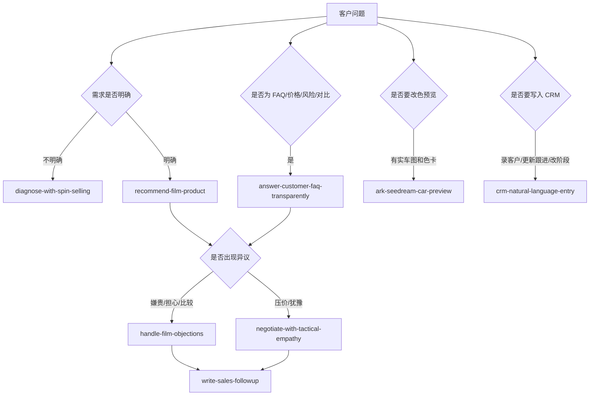

# Skill Map

## 核心销售流程

```mermaid
flowchart TD
  A["客户问题"] --> B{"需求是否明确"}
  B -->|不明确| C["diagnose-with-spin-selling"]
  B -->|明确| D["recommend-film-product"]
  A --> E{"是否为 FAQ/价格/风险/对比"}
  E -->|是| F["answer-customer-faq-transparently"]
  D --> G{"是否出现异议"}
  F --> G
  G -->|嫌贵/担心/比较| H["handle-film-objections"]
  G -->|压价/犹豫| I["negotiate-with-tactical-empathy"]
  H --> J["write-sales-followup"]
  I --> J
  A --> K{"是否要改色预览"}
  K -->|有实车图和色卡| L["ark-seedream-car-preview"]
  A --> M{"是否要写入 CRM"}
  M -->|录客户/更新跟进/改阶段| N["crm-natural-language-entry"]
```

## 路由原则

- 需求不清楚：先诊断，不推荐。
- 问硬问题：透明回答，不回避。
- 出现阻力：先处理顾虑，再推进下一步。
- 需要发客户：生成短话术。
- 要看颜色上车：走改色生图，不用纯色值替代色卡图。
- 要录客户或更新跟进：走 CRM 自然语言填写，先确认摘要，再用 `lark-cli base` 写入。
