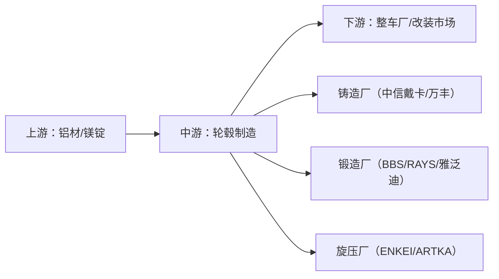

# 汽车轮毂 关键玩家

## 国际品牌

| 名称 | 国家 | 定位 | 核心产品 | 特点 | 价格区间（单只/18寸） |
|------|------|------|---------|------|---------------------|
| **BBS** | 德国/日本 | 赛道之王 | LM, FI-R, RID, CH-R | 锻造工艺巅峰，金色=日本锻造/银色=德国铸造，F1 供应商 | ¥4000-15000 |
| **RAYS** | 日本 | JDM 灵魂 | TE37, CE28, VR G2 | 万吨锻造，TE37 是改装圈图腾级产品，极致轻量化 | ¥3500-10000 |
| **OZ** | 意大利 | 赛车基因 | Ultraleggera, Superturismo | HLT 旋压技术，F1/WRC 供应商，设计感强 | ¥2000-6000 |
| **WORK** | 日本 | 姿态美学 | Emotion CR, VS, Meister | 三片式定制王者，VIP/低趴首选 | ¥2500-8000 |
| **VOSSEN** | 美国 | 设计先锋 | VFS, HF, S21 | 创新设计，定制颜色/表面处理，网红车型高频出镜 | ¥2500-7000 |
| **HRE** | 美国 | 顶奢定制 | P1, 3D+, Vintage | 按订单生产，碳纤维轮毂，单片到三片全有 | ¥8000-30000+ |
| **ENKEI** | 日本 | 性能性价比 | RPF1, NT03, PF01 | MAT 旋压技术，赛道圈速验证，性价比高 | ¥1500-4000 |

## 国产品牌

| 名称                  | 定位     | 核心产品         | 特点                            | 价格区间（单只/18寸） |
| ------------------- | ------ | ------------ | ----------------------------- | ------------ |
| **雅泛迪 (Advanti)**   | 国产锻造标杆 | MR2, SL, N系列 | Flow Forming 旋压，出口全球，新加坡品牌中国造 | ¥1000-3000   |
| **中信戴卡 (Dicastal)** | OEM 巨头 | 原厂配套         | 全球最大铝轮毂制造商，给奔驰/宝马/奥迪配套        | ¥300-800（原厂） |
| **万丰奥威 (Wanfeng)**  | 全产业链   | 铸造→锻造全覆盖     | 收购了镁瑞丁（镁合金轮毂），A 股上市           | ¥500-2000    |
| **ARTKA**           | 国产赛道新锐 | RS, YA 系列    | 专注旋压/锻造，赛道圈速数据支撑              | ¥1500-3500   |

## 产业链

## 竞争格局

- **日系三强**：BBS（锻造）、RAYS（锻造）、WORK（三片式）各占一个山头
- **欧洲两强**：OZ（赛车）、BBS 德国（铸造+OE）覆盖欧洲市场
- **美国两强**：HRE（顶奢）、VOSSEN（设计）占领高端改装
- **中国崛起**：中信戴卡是全球最大的铝轮毂制造商，雅泛迪/ARTKA 在性能改装市场快速上升
