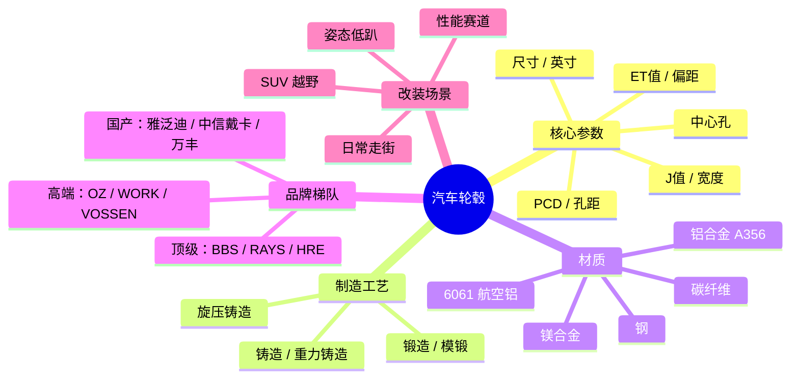

# 汽车轮毂 — 快速入门

> 🕐 生成时间：2026-06-08
> 📁 来源：`domain-rapid-learning` skill 自动输出

## 一句话定义

轮毂是连接车轮和车轴的金属部件，支撑整车重量，决定车辆外观、操控性能和安全。

## 为什么重要

- 轮毂是 **簧下质量** 的核心——每减轻 1kg 轮毂 ≈ 车身减重 15kg 的效果
- 直接影响操控：更轻的轮毂 = 更敏捷的转向 + 更短的刹车距离
- 中国改装市场快速增长，轮毂是「买车后第一个想换的零件」
- 新能源车大尺寸轮毂趋势明显（18-22 寸成为主流）

## 全景地图

## 文件导航

| 文件 | 内容 |
|------|------|
| [术语表](01-terminology.md) | 25 个核心术语，三级分类 |
| [核心概念](02-core-concepts.md) | 5 个必须理解的概念，配有类比 |
| [关键玩家](03-key-players.md) | 10 个主要品牌，国际+国产 |
| [常见问题](04-common-questions.md) | 20 个新手最常问 |
| [学习路径](05-learning-path.md) | 3 阶段入门路线 |
| [发展简史](07-history.md) | 从钢丝轮到碳纤维——六代轮毂进化史 |
| [参数溯源](08-why-parameters.md) | 为什么参数这样定义？J/ET/PCD 的来历和工程逻辑 |
| [悬挂几何](09-suspension-geometry.md) | Scrub Radius / Roll Center — 改 ET 值后底盘发生了什么 |
| [销售话术](10-sales-explanation.md) | 🛒 怎么向客户解释轮毂改装？3 场景 × 3 层话术 |
| [真伪鉴别](11-authenticity-guide.md) | 🔍 七法辨真假 — 300 块的 TE37 怎么一眼看穿 |
| [交叉销售](12-cross-sell-film-ppf.md) | 🎯 轮毂 × 车膜/PPF — 独属于有膜有漾的销售武器 |
| [量参数](13-measure-your-car.md) | 📏 五步教会客户量自己车的轮毂参数 |
| [设计搭配](14-wheel-styling.md) | 🎨 七种轮毂造型 + 车型速配 + 颜色法则 |
| [新能源车轮毂](15-ev-wheels.md) | ⚡ 特斯拉/蔚来/理想车主的轮毂需求完全指南 |
| [资源汇总](06-resources.md) | 文章/视频/工具/社区 |
