# 小米 SU7 产品款式

来源：`/Users/fkycoya/Downloads/小米产品款式.xls`

| 序号 | 产品名称 | 图片 | 源表行 |
| --- | --- | --- | --- |
| 1 | 前包围 |  | 5 |
| 2 | 刹车油门踏板 | 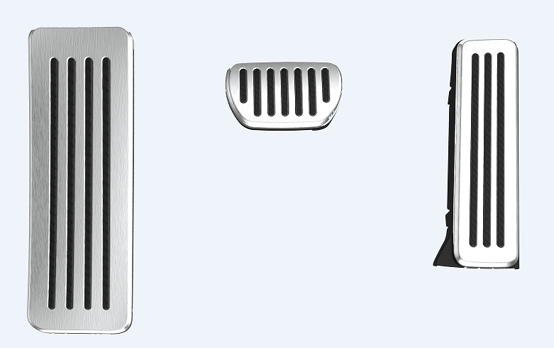 | 6 |
| 3 | 座椅背板 | 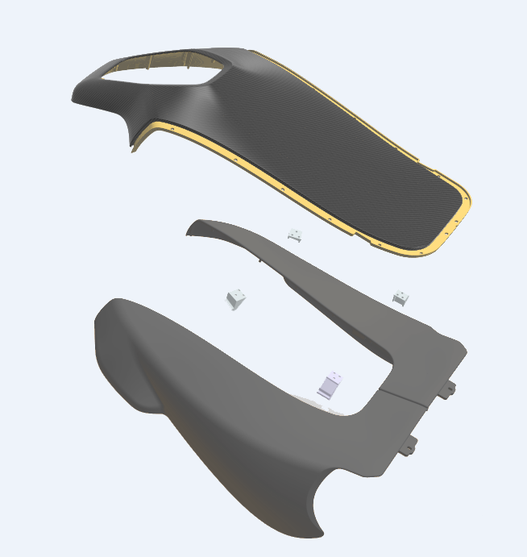 | 7 |
| 4 | 侧裙 | 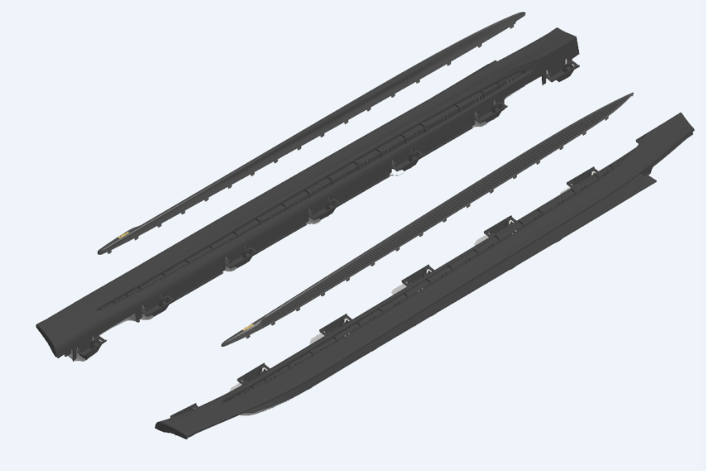 | 9 |
| 5 | 方向盘 | 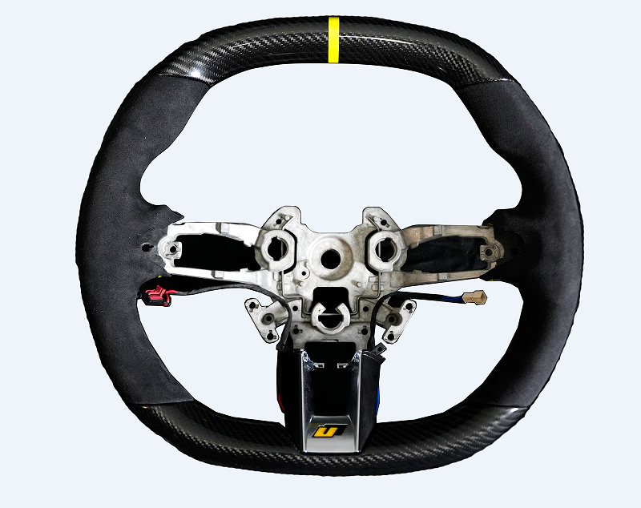 | 10 |
| 6 | 出风口 | 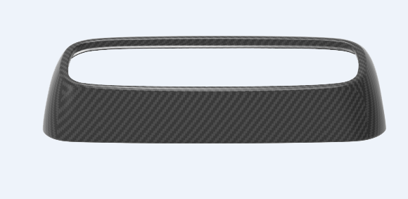 | 11 |
| 7 | 后视镜 | 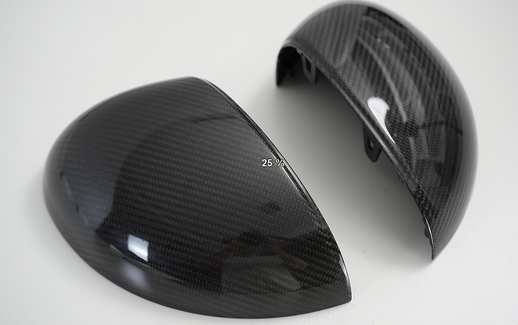 | 12 |
| 8 | 机盖 | 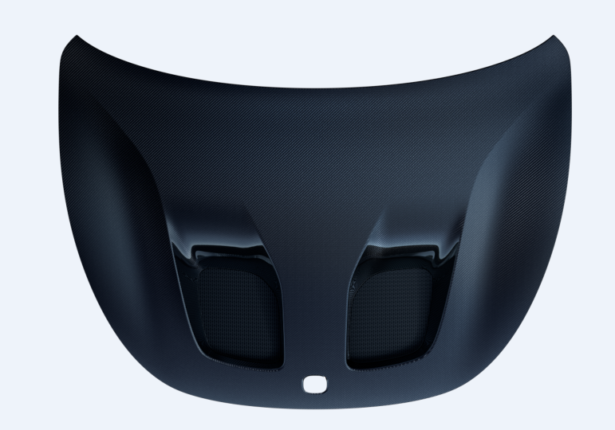 | 13 |
| 9 | 门饰条 | 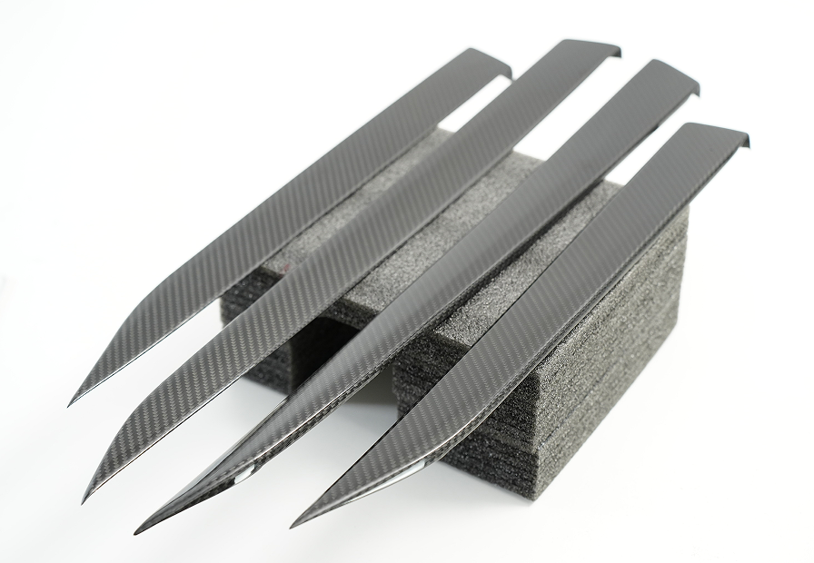 | 14 |
| 10 | 尾翼 | 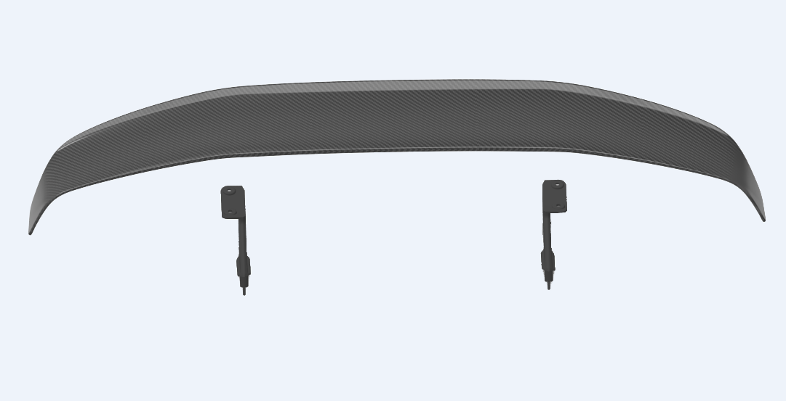 | 15 |
| 11 | 迎宾踏板 | 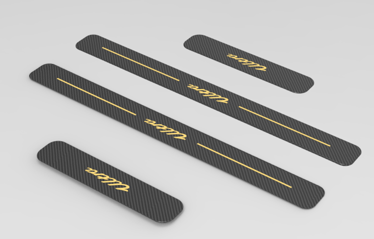 | 16 |
| 12 | 中控面板 | 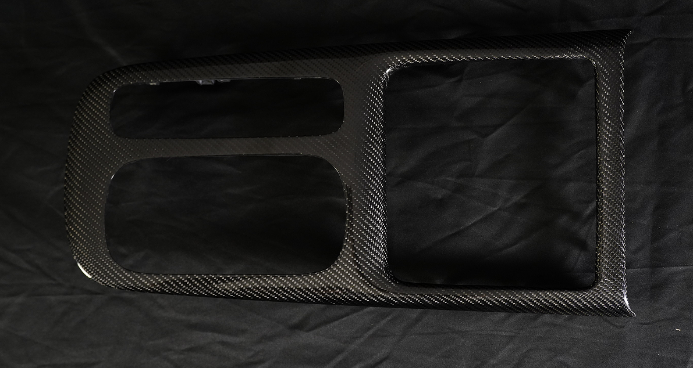 | 17 |
