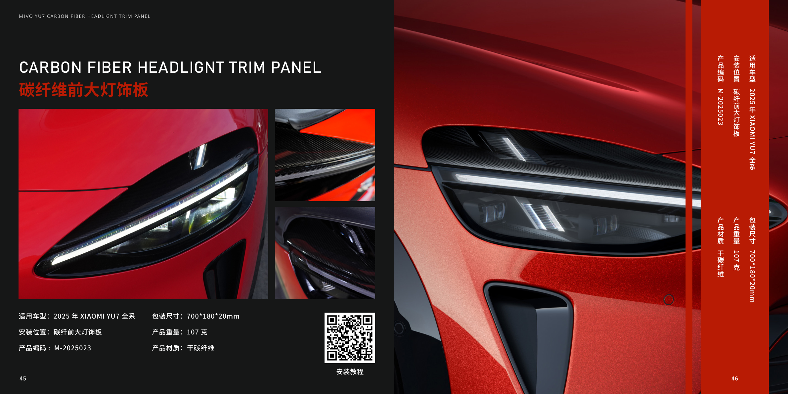
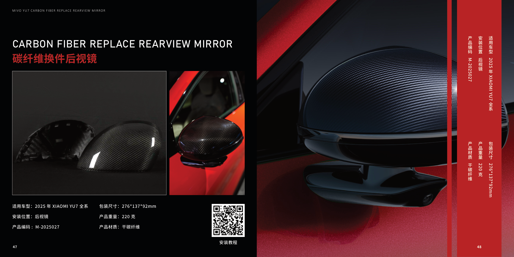
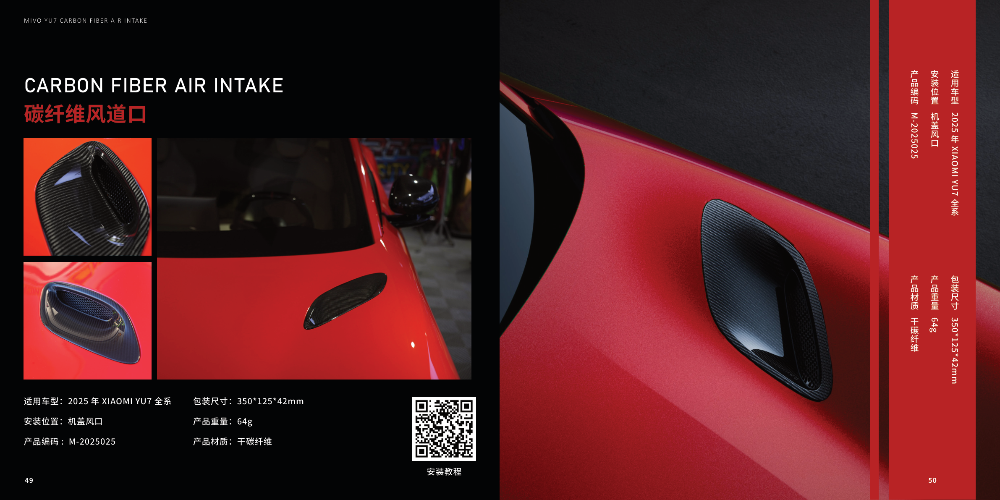
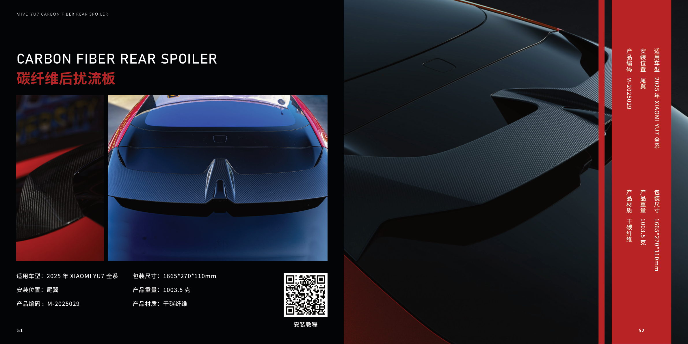
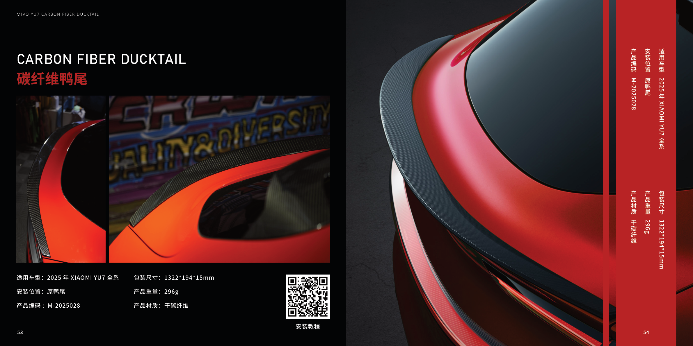
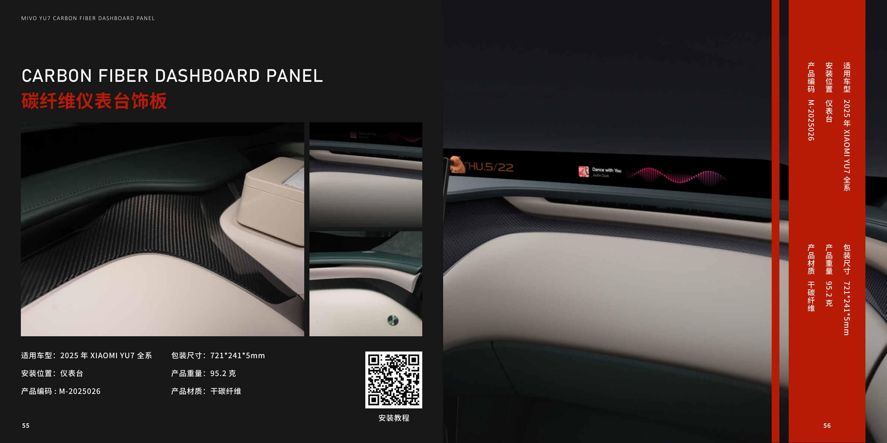
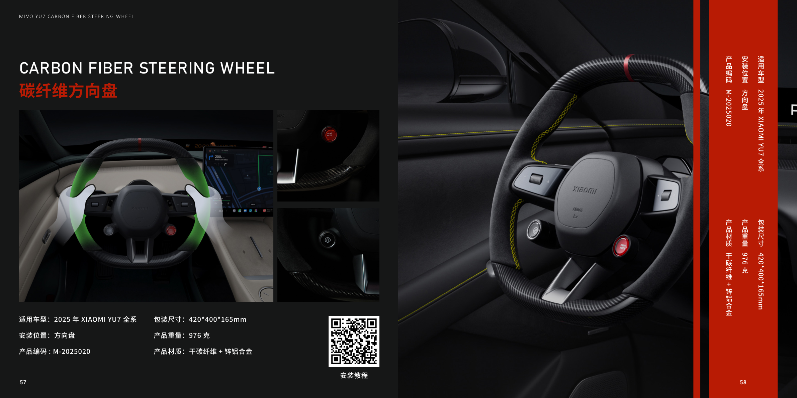
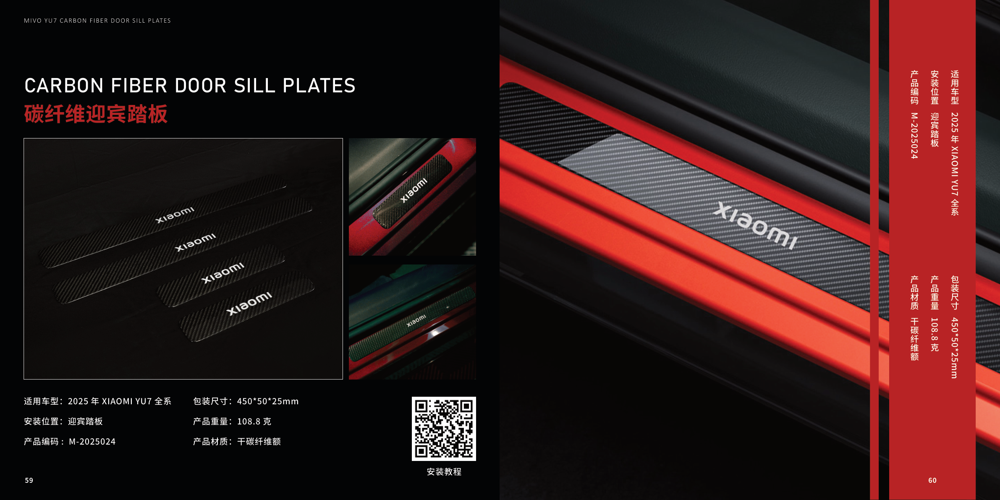

# 米沃产品图册结构化目录

来源：`/Users/fkycoya/Library/Containers/com.tencent.xinWeChat/Data/Library/Caches/com.tencent.xinWeChat/2.0b4.0.9/c121b94e5d016384d393d3d119cb2e7d/SaveTemp/4fadf6de041478ed949d5d3333e228f5/2025.12.06-米沃图册.pdf`

产品数量：30

| 车型 | 系列 | 产品 | 编码 | 材质 | 安装位置 | 来源页 | 页面图 |
| --- | --- | --- | --- | --- | --- | --- | --- |
| SU7 | SU7 外观套件 | Ultra 同款前包围 | M-2025016 | PP+EPDM-TD20 | 前包围 | PDF p.9 / 图册 01-02 |  |
| SU7 | SU7 外观套件 | Ultra 同款后包围 | M-2025017 | PP+EPDM-TD20 | 后包围 | PDF p.10 / 图册 03-04 |  |
| SU7 | SU7 外观套件 | 干碳纤维侧裙 | M-2025002 | PP+EPDM-TD20+干碳纤维 | 侧裙 | PDF p.11 / 图册 05-06 |  |
| SU7 | SU7 外观套件 | 碳纤维挖孔机盖 | 资料未提供 | 干碳纤维 | 机盖 | PDF p.12 / 图册 07-08 |  |
| SU7 | SU7 外观套件 | 碳纤维尾翼 | M-2025001 | 干碳纤维 | 尾翼 | PDF p.13 / 图册 09-10 |  |
| SU7 | SU7 外观套件 | 可调节电动尾翼 | 资料未提供 | 铝合金 | 电动尾翼 | PDF p.14 / 图册 11-12 |  |
| SU7 | SU7 外观套件 | 空气动力学一拖四进气通道 | 资料未提供 | ABS | 前包围 | PDF p.15 / 图册 13-14 |  |
| SU7 | SU7 外观套件 | 碳纤维换件后视镜 | M-2025002 | 干碳纤维 | 后视镜 | PDF p.16 / 图册 15-16 |  |
| SU7 | SU7 内饰套件 | 中控台粘贴/替换款碳纤维饰板 | M-2025003 / M-2025007 | 干碳纤维+ABS | 中控台 | PDF p.19 / 图册 17-18 |  |
| SU7 | SU7 内饰套件 | 中控台按键 | 资料未提供 | ABS | 中控台 | PDF p.20 / 图册 19-20 |  |
| SU7 | SU7 内饰套件 | 碳纤维四门饰板 | M-2025004 | 干碳纤维 | 门板 | PDF p.21 / 图册 21-22 |  |
| SU7 | SU7 内饰套件 | 碳纤维迎宾踏板 | M-2025005 | 干碳纤维 | 迎宾踏板 | PDF p.22 / 图册 23-24 |  |
| SU7 | SU7 内饰套件 | 碳纤维换件后出风口 | M-2025009 | 干碳纤维+ABS | 空调出风口 | PDF p.23 / 图册 25-26 |  |
| SU7 | SU7 内饰套件 | 碳纤维座椅后饰板 | M-2025010 | 干碳纤维+ABS | 前排座椅 | PDF p.24 / 图册 27-28 |  |
| SU7 | SU7 内饰套件 | 碳纤维方向盘 | M-2025020 | 干碳纤维+锌铝合金 | 方向盘 | PDF p.25 / 图册 29-30 |  |
| SU7 | SU7 内饰套件 | 不锈钢刹车油门踏板 | 资料未提供 | 304 不锈钢 | 刹车油门踏板 | PDF p.26 / 图册 31-32 |  |
| SU7 | SU7 内饰包覆件 | 座椅皮套包覆 | 资料未提供 | Napa 真皮+Alcantara 翻毛皮 | 座椅 | PDF p.27 / 图册 33-34 |  |
| SU7 | SU7 内饰包覆件 | 翻毛皮顶棚包覆 | 资料未提供 | Alcantara 翻毛皮 | 顶棚 | PDF p.28 / 图册 35-36 |  |
| SU7 | SU7 内饰包覆件 | 扶手箱改色包覆 | 资料未提供 | Napa 真皮 | 扶手箱 | PDF p.29 / 图册 37-38 |  |
| SU7 | SU7 内饰包覆件 | 翻毛皮 ABC 柱包覆 | 资料未提供 | Alcantara 翻毛皮 | ABC 柱 | PDF p.30 / 图册 39-40 |  |
| SU7 | SU7 内饰包覆件 | 四门门板翻毛皮内饰包覆 | 资料未提供 | Napa 真皮+Alcantara 翻毛皮 | 门板 | PDF p.31 / 图册 41-42 |  |
| SU7 | SU7 内饰包覆件 | 中控仪表台内饰包覆 | 资料未提供 | Napa 真皮+Alcantara 翻毛皮 | 中控仪表台 | PDF p.32 / 图册 43-44 |  |
| YU7 | YU7 外观套件 | 碳纤维前大灯饰板 | M-2025023 | 干碳纤维 | 碳纤前大灯饰板 | PDF p.35 / 图册 45-46 |  |
| YU7 | YU7 外观套件 | 碳纤维换件后视镜 | M-2025027 | 干碳纤维 | 后视镜 | PDF p.36 / 图册 47-48 |  |
| YU7 | YU7 外观套件 | 碳纤维风道口 | M-2025025 | 干碳纤维 | 机盖风口 | PDF p.37 / 图册 49-50 |  |
| YU7 | YU7 外观套件 | 碳纤维后扰流板 | M-2025029 | 干碳纤维 | 尾翼 | PDF p.38 / 图册 51-52 |  |
| YU7 | YU7 外观套件 | 碳纤维鸭尾 | M-2025028 | 干碳纤维 | 原鸭尾 | PDF p.39 / 图册 53-54 |  |
| YU7 | YU7 内饰套件 | 碳纤维仪表台饰板 | M-2025026 | 干碳纤维 | 仪表台 | PDF p.42 / 图册 55-56 |  |
| YU7 | YU7 内饰套件 | 碳纤维方向盘 | M-2025020 | 干碳纤维+锌铝合金 | 方向盘 | PDF p.43 / 图册 57-58 |  |
| YU7 | YU7 内饰套件 | 碳纤维迎宾踏板 | M-2025024 | 干碳纤维 | 迎宾踏板 | PDF p.44 / 图册 59-60 |  |
