# 米沃 SU7 产品知识卡

来源：`/Users/fkycoya/Library/Containers/com.tencent.xinWeChat/Data/Library/Caches/com.tencent.xinWeChat/2.0b4.0.9/c121b94e5d016384d393d3d119cb2e7d/SaveTemp/4fadf6de041478ed949d5d3333e228f5/2025.12.06-米沃图册.pdf`

## 产品清单

### Ultra 同款前包围

- 系列：SU7 外观套件
- 适用车型：2024 年 XIAOMI SU7 全系
- 安装位置：前包围
- 产品编码：M-2025016
- 包装尺寸：2050*870*925mm
- 产品重量：12845 克
- 产品材质：PP+EPDM-TD20
- 来源：PDF p.9 / 图册页 01-02
- 页面图：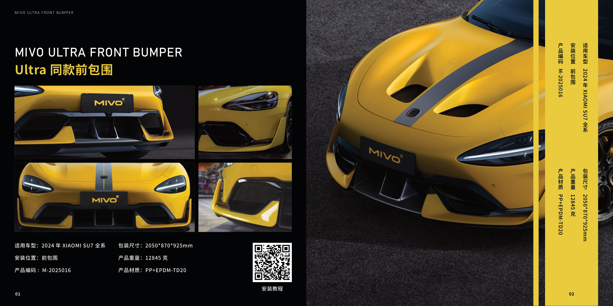

### Ultra 同款后包围

- 系列：SU7 外观套件
- 适用车型：2024 年 XIAOMI SU7 全系
- 安装位置：后包围
- 产品编码：M-2025017
- 包装尺寸：2050*870*925mm
- 产品重量：8812 克
- 产品材质：PP+EPDM-TD20
- 来源：PDF p.10 / 图册页 03-04
- 页面图：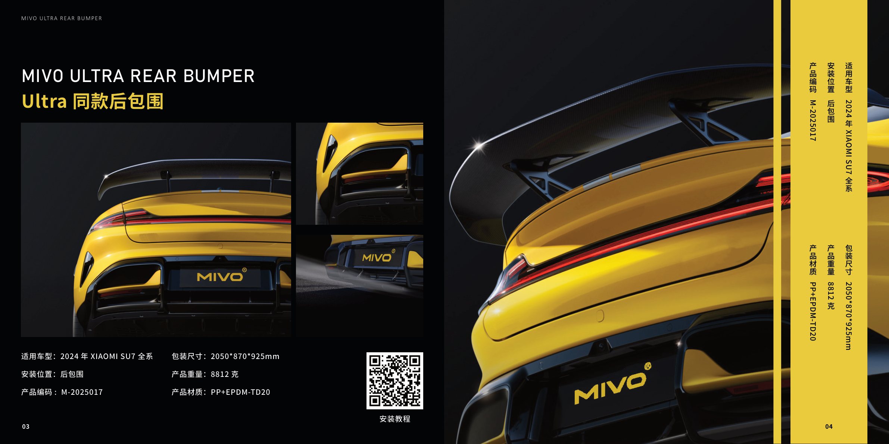

### 干碳纤维侧裙

- 系列：SU7 外观套件
- 适用车型：2024 年 XIAOMI SU7 全系
- 安装位置：侧裙
- 产品编码：M-2025002
- 包装尺寸：2285*300*190mm
- 产品重量：4944 克
- 产品材质：PP+EPDM-TD20+干碳纤维
- 来源：PDF p.11 / 图册页 05-06
- 页面图：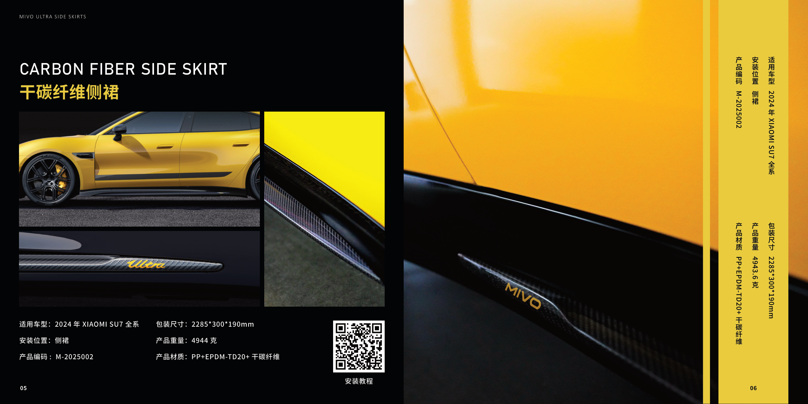
- 待确认：编码 M-2025002 与 SU7 后视镜页重复，需向供应商确认。

### 碳纤维挖孔机盖

- 系列：SU7 外观套件
- 适用车型：2024 年 XIAOMI SU7 全系
- 安装位置：机盖
- 产品编码：资料未提供
- 包装尺寸：资料未提供
- 产品重量：资料未提供
- 产品材质：干碳纤维
- 来源：PDF p.12 / 图册页 07-08
- 页面图：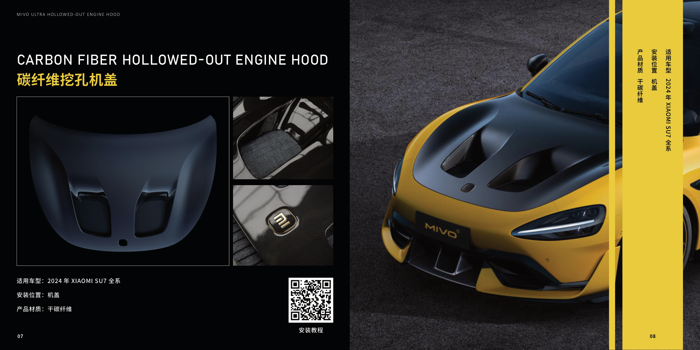

### 碳纤维尾翼

- 系列：SU7 外观套件
- 适用车型：2024 年 XIAOMI SU7 全系
- 安装位置：尾翼
- 产品编码：M-2025001
- 包装尺寸：1650*250*485mm
- 产品重量：3540 克
- 产品材质：干碳纤维
- 来源：PDF p.13 / 图册页 09-10
- 页面图：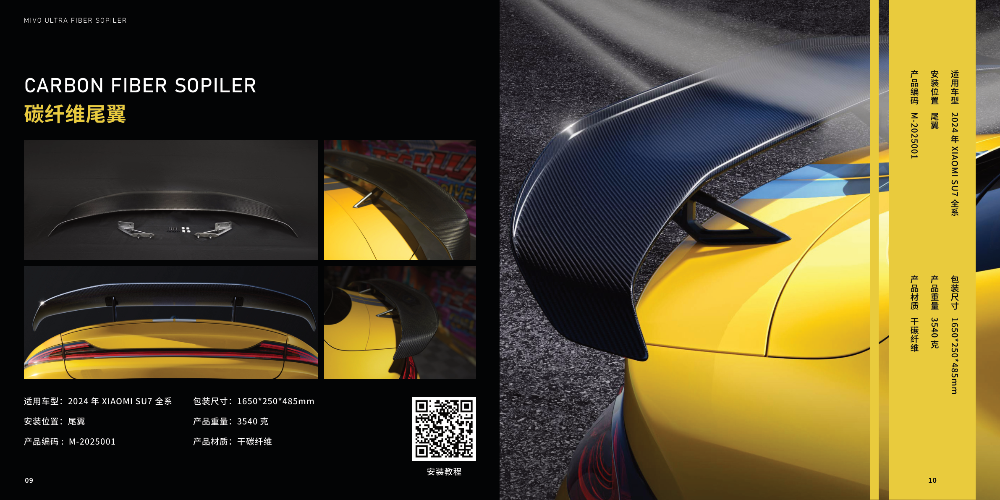

### 可调节电动尾翼

- 系列：SU7 外观套件
- 适用车型：2024 年 XIAOMI SU7 全系
- 安装位置：电动尾翼
- 产品编码：资料未提供
- 包装尺寸：资料未提供
- 产品重量：资料未提供
- 产品材质：铝合金
- 来源：PDF p.14 / 图册页 11-12
- 页面图：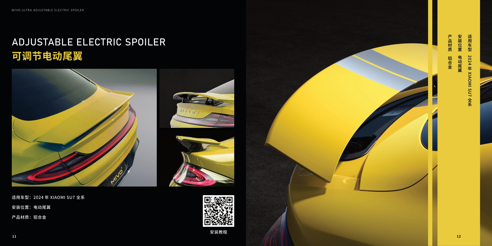

### 空气动力学一拖四进气通道

- 系列：SU7 外观套件
- 适用车型：2024 年 XIAOMI SU7 全系
- 安装位置：前包围
- 产品编码：资料未提供
- 包装尺寸：资料未提供
- 产品重量：1990 克
- 产品材质：ABS
- 来源：PDF p.15 / 图册页 13-14
- 页面图：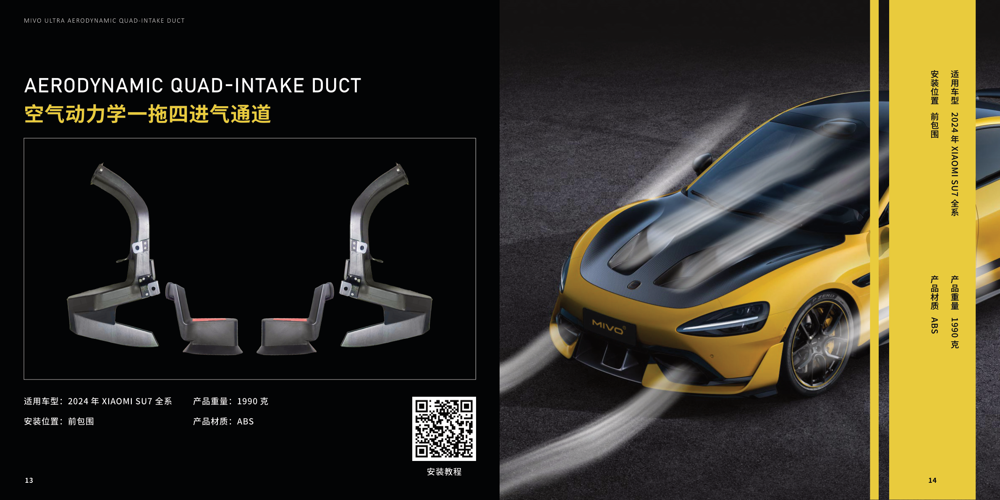

### 碳纤维换件后视镜

- 系列：SU7 外观套件
- 适用车型：2024 年 XIAOMI SU7 全系
- 安装位置：后视镜
- 产品编码：M-2025002
- 包装尺寸：330*280*130mm
- 产品重量：220 克
- 产品材质：干碳纤维
- 来源：PDF p.16 / 图册页 15-16
- 页面图：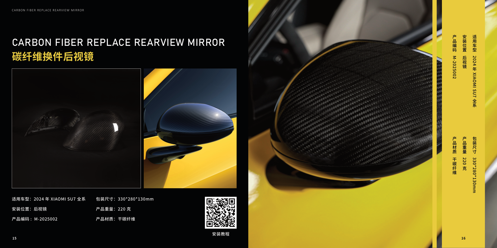
- 待确认：编码 M-2025002 与 SU7 侧裙页重复，需向供应商确认。

### 中控台粘贴/替换款碳纤维饰板

- 系列：SU7 内饰套件
- 适用车型：2024 年 XIAOMI SU7 全系
- 安装位置：中控台
- 产品编码：M-2025003 / M-2025007
- 包装尺寸：555*315*55mm（粘贴）/ 553*315*60mm（替换）
- 产品重量：65 克（粘贴）/ 220 克（替换）
- 产品材质：干碳纤维+ABS
- 来源：PDF p.19 / 图册页 17-18
- 页面图：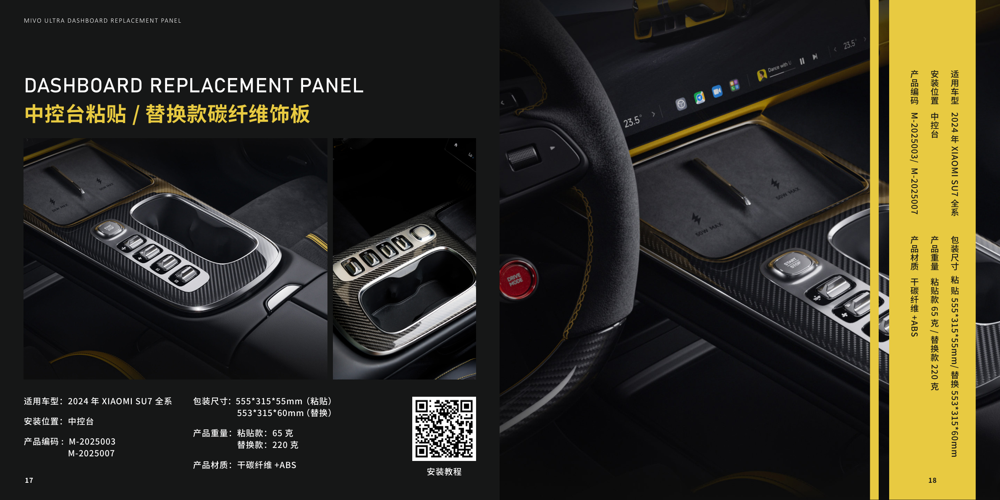

### 中控台按键

- 系列：SU7 内饰套件
- 适用车型：2024 年 XIAOMI SU7 全系
- 安装位置：中控台
- 产品编码：资料未提供
- 包装尺寸：资料未提供
- 产品重量：250 克
- 产品材质：ABS
- 来源：PDF p.20 / 图册页 19-20
- 页面图：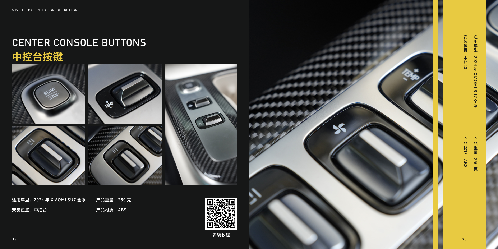

### 碳纤维四门饰板

- 系列：SU7 内饰套件
- 适用车型：2024 年 XIAOMI SU7 全系
- 安装位置：门板
- 产品编码：M-2025004
- 包装尺寸：590*55*40mm
- 产品重量：102 克
- 产品材质：干碳纤维
- 来源：PDF p.21 / 图册页 21-22
- 页面图：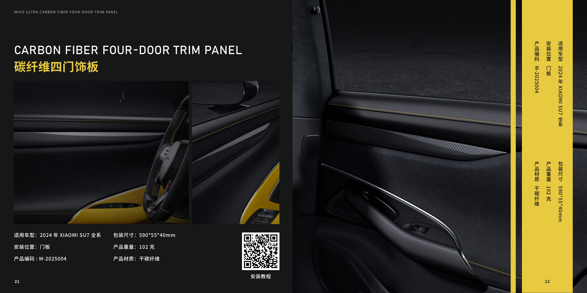

### 碳纤维迎宾踏板

- 系列：SU7 内饰套件
- 适用车型：2024 年 XIAOMI SU7 全系
- 安装位置：迎宾踏板
- 产品编码：M-2025005
- 包装尺寸：450*50*25mm
- 产品重量：100 克
- 产品材质：干碳纤维
- 来源：PDF p.22 / 图册页 23-24
- 页面图：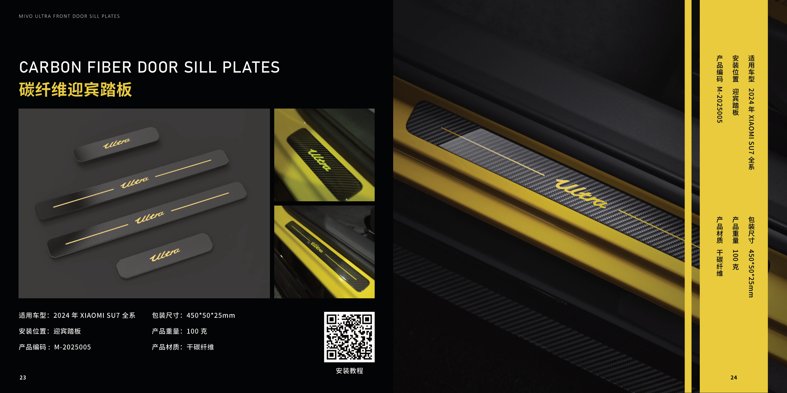

### 碳纤维换件后出风口

- 系列：SU7 内饰套件
- 适用车型：2024 年 XIAOMI SU7 全系
- 安装位置：空调出风口
- 产品编码：M-2025009
- 包装尺寸：270*120*75mm
- 产品重量：60 克
- 产品材质：干碳纤维+ABS
- 来源：PDF p.23 / 图册页 25-26
- 页面图：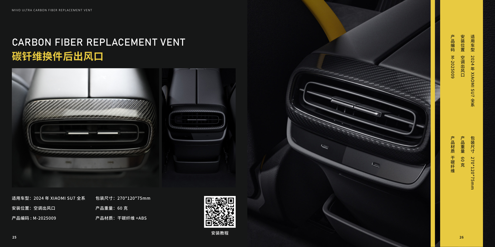

### 碳纤维座椅后饰板

- 系列：SU7 内饰套件
- 适用车型：2024 年 XIAOMI SU7 全系
- 安装位置：前排座椅
- 产品编码：M-2025010
- 包装尺寸：890*605*312mm
- 产品重量：1570 克
- 产品材质：干碳纤维+ABS
- 来源：PDF p.24 / 图册页 27-28
- 页面图：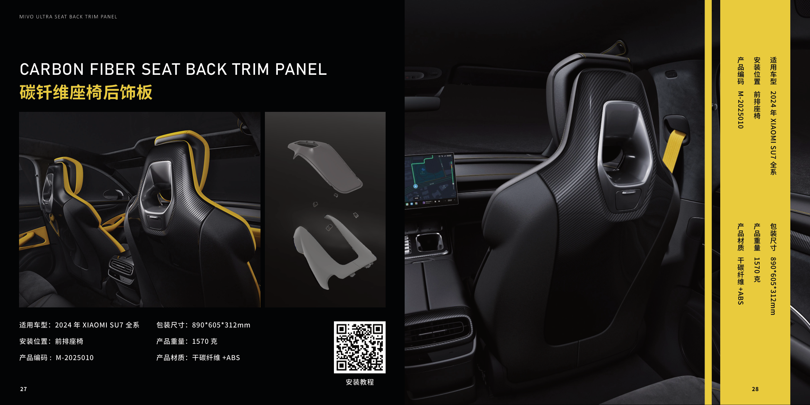

### 碳纤维方向盘

- 系列：SU7 内饰套件
- 适用车型：2024 年 XIAOMI SU7 全系
- 安装位置：方向盘
- 产品编码：M-2025020
- 包装尺寸：420*400*165mm
- 产品重量：976 克
- 产品材质：干碳纤维+锌铝合金
- 来源：PDF p.25 / 图册页 29-30
- 页面图：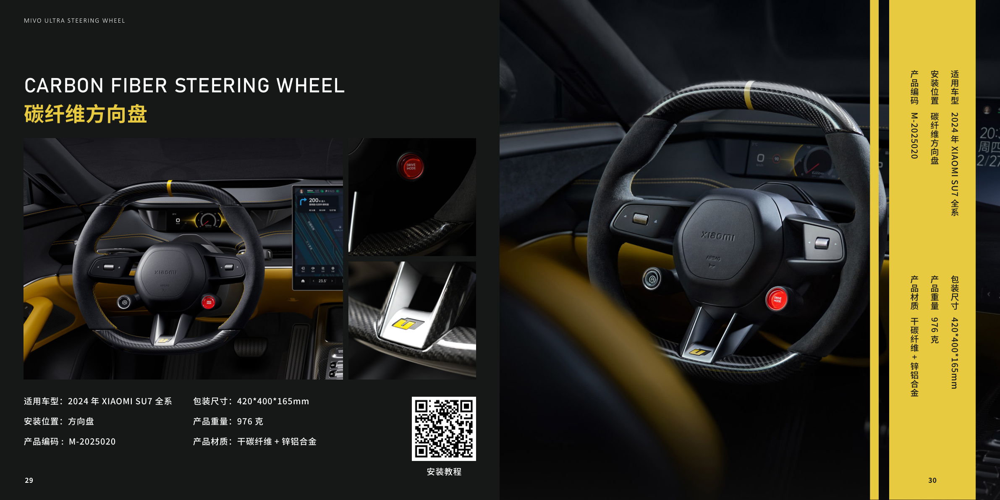

### 不锈钢刹车油门踏板

- 系列：SU7 内饰套件
- 适用车型：2024 年 XIAOMI SU7 全系
- 安装位置：刹车油门踏板
- 产品编码：资料未提供
- 包装尺寸：资料未提供
- 产品重量：资料未提供
- 产品材质：304 不锈钢
- 来源：PDF p.26 / 图册页 31-32
- 页面图：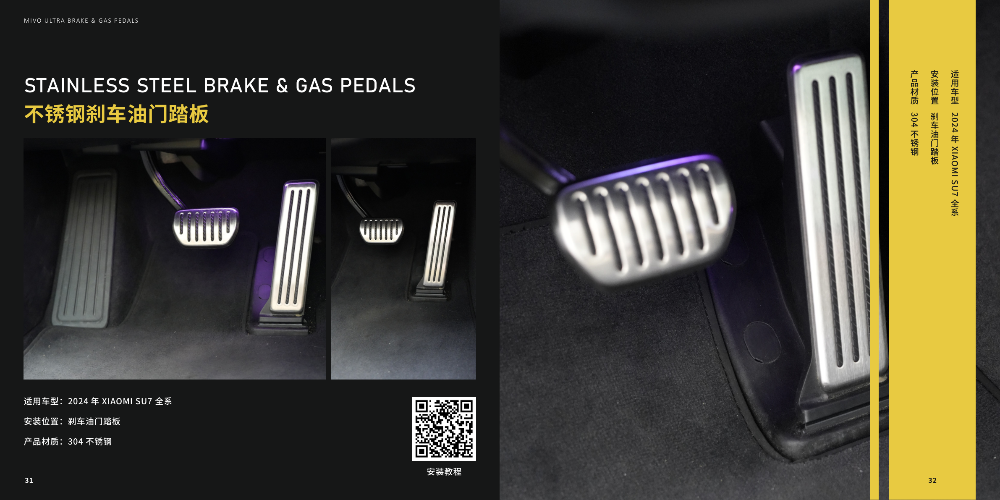

### 座椅皮套包覆

- 系列：SU7 内饰包覆件
- 适用车型：2024 年 XIAOMI SU7 全系
- 安装位置：座椅
- 产品编码：资料未提供
- 包装尺寸：资料未提供
- 产品重量：资料未提供
- 产品材质：Napa 真皮+Alcantara 翻毛皮
- 来源：PDF p.27 / 图册页 33-34
- 页面图：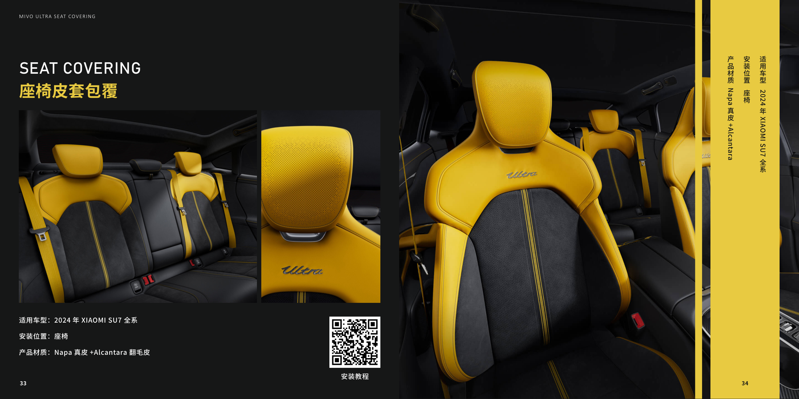

### 翻毛皮顶棚包覆

- 系列：SU7 内饰包覆件
- 适用车型：2024 年 XIAOMI SU7 全系
- 安装位置：顶棚
- 产品编码：资料未提供
- 包装尺寸：资料未提供
- 产品重量：资料未提供
- 产品材质：Alcantara 翻毛皮
- 来源：PDF p.28 / 图册页 35-36
- 页面图：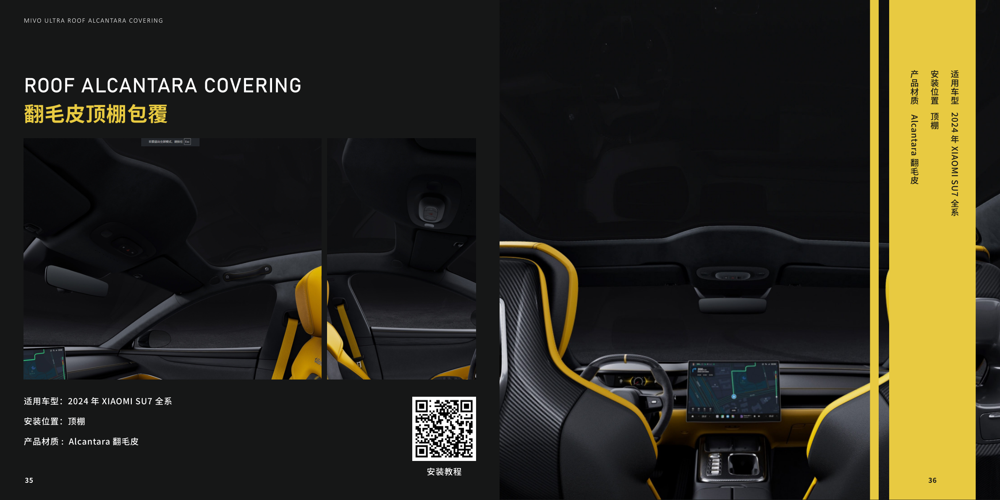

### 扶手箱改色包覆

- 系列：SU7 内饰包覆件
- 适用车型：2024 年 XIAOMI SU7 全系
- 安装位置：扶手箱
- 产品编码：资料未提供
- 包装尺寸：资料未提供
- 产品重量：资料未提供
- 产品材质：Napa 真皮
- 来源：PDF p.29 / 图册页 37-38
- 页面图：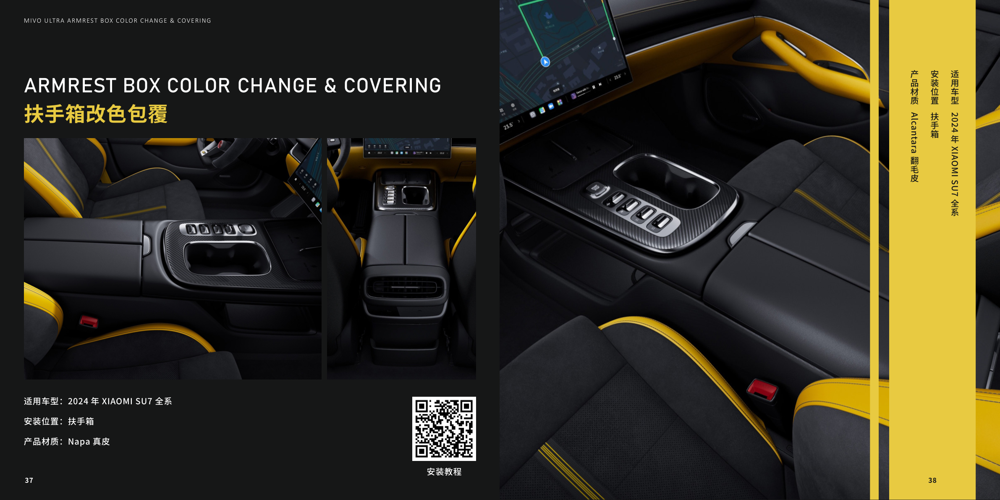
- 待确认：同页竖排文本出现 Alcantara 翻毛皮，横排参数为 Napa 真皮，需确认最终材质。

### 翻毛皮 ABC 柱包覆

- 系列：SU7 内饰包覆件
- 适用车型：2024 年 XIAOMI SU7 全系
- 安装位置：ABC 柱
- 产品编码：资料未提供
- 包装尺寸：资料未提供
- 产品重量：资料未提供
- 产品材质：Alcantara 翻毛皮
- 来源：PDF p.30 / 图册页 39-40
- 页面图：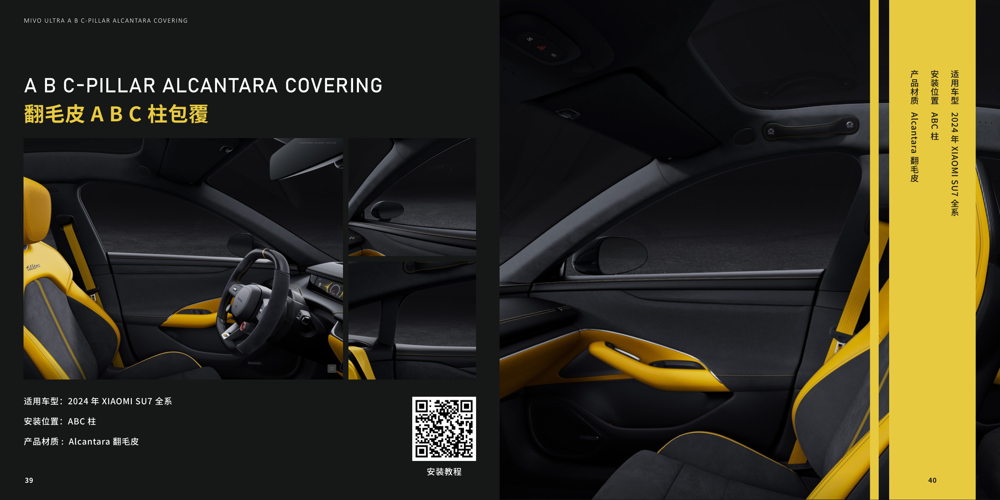

### 四门门板翻毛皮内饰包覆

- 系列：SU7 内饰包覆件
- 适用车型：2024 年 XIAOMI SU7 全系
- 安装位置：门板
- 产品编码：资料未提供
- 包装尺寸：资料未提供
- 产品重量：资料未提供
- 产品材质：Napa 真皮+Alcantara 翻毛皮
- 来源：PDF p.31 / 图册页 41-42
- 页面图：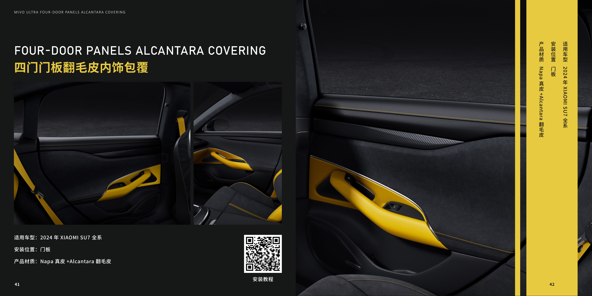

### 中控仪表台内饰包覆

- 系列：SU7 内饰包覆件
- 适用车型：2024 年 XIAOMI SU7 全系
- 安装位置：中控仪表台
- 产品编码：资料未提供
- 包装尺寸：资料未提供
- 产品重量：资料未提供
- 产品材质：Napa 真皮+Alcantara 翻毛皮
- 来源：PDF p.32 / 图册页 43-44
- 页面图：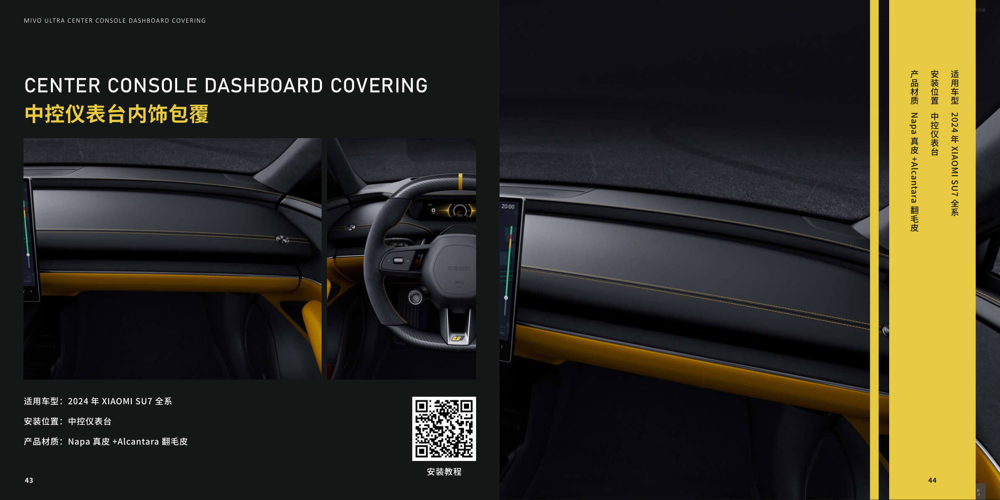
